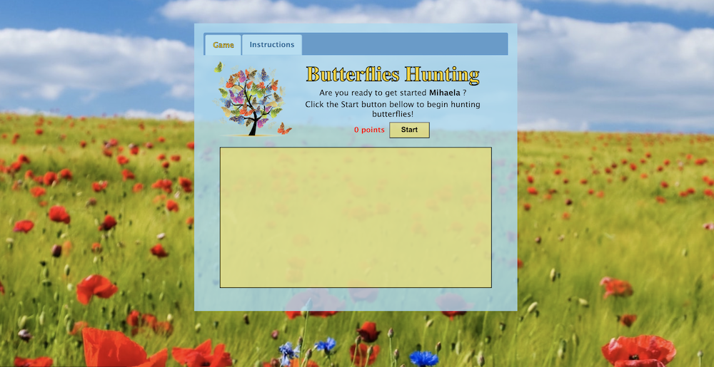
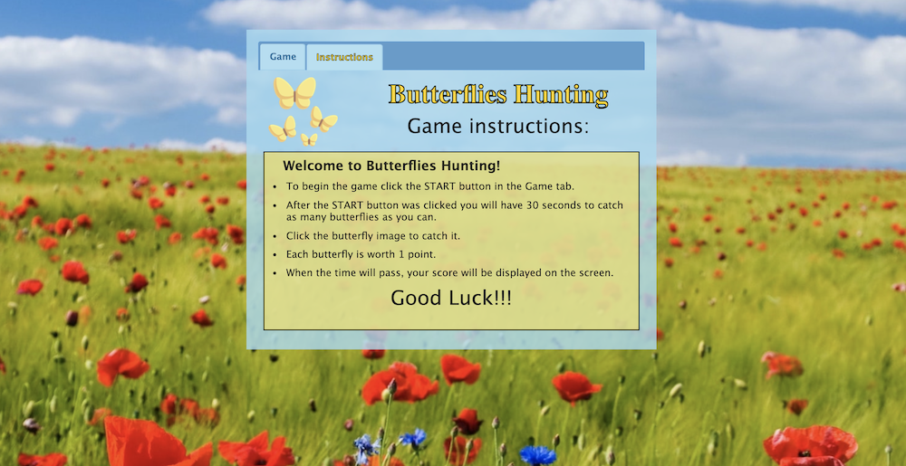
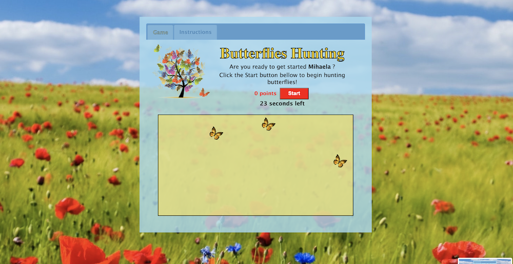

# Butterflies Hunting Game

## I created the Butterflies Hunting Game as an final project in my JavaScript class at Columbus State Community College.
## The main functionality of the game is that an user have the possibility to hunt butterflies and receive points for this.

## As technologies, I used JavaScript, HTML, jQuery, jQuery UI, Bootstrap, and CSS.

## You can try out and play the game [here](https://mihaelavalac.github.io/butterflies-hunting/)

